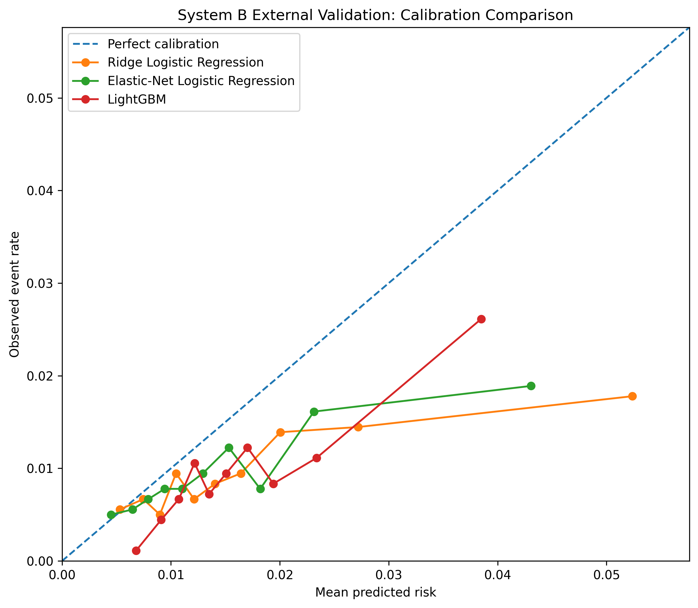
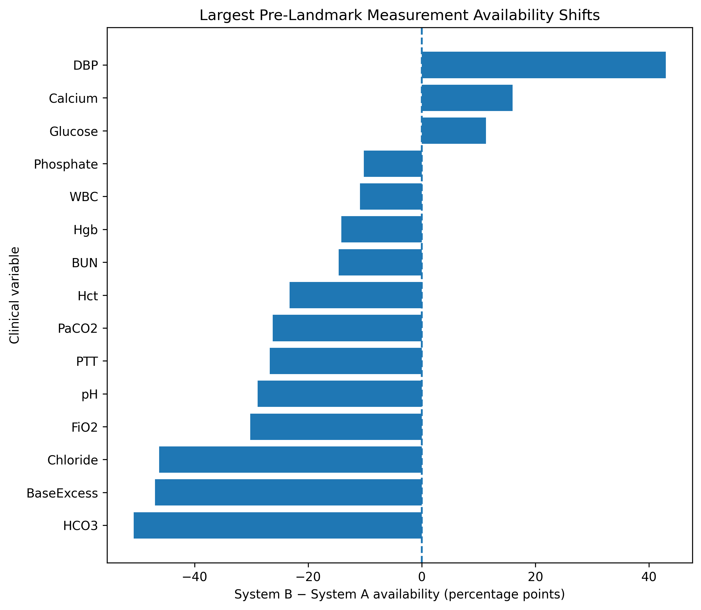
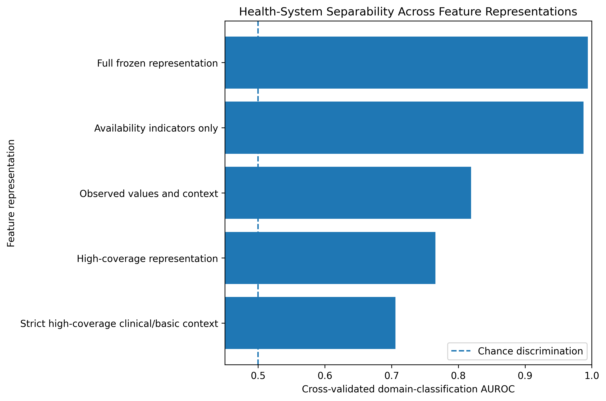
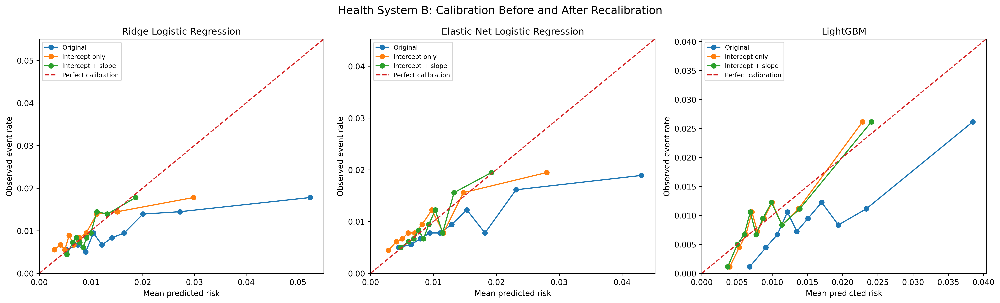
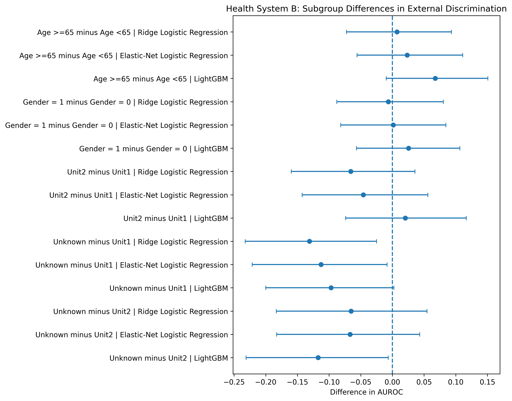

# Cross-Health-System Transportability of Sepsis Risk Prediction: External Validation, Distribution Shift, and Target-System Recalibration

## Abstract

### Background

Clinical prediction models may perform adequately during internal
validation yet lose reliability when transported across health systems
with different patient populations, measurement practices, and
documentation processes.

### Objective

To evaluate the transportability of probabilistic sepsis risk models
across two health systems and characterize changes in discrimination,
calibration, measurement processes, target-system recalibration, and
subgroup performance.

### Methods

We used the PhysioNet/Computing in Cardiology Challenge 2019 sepsis
dataset and constructed a landmark prediction task at ICU hour 6.

The outcome was incident sepsis onset during ICU hours $(6,18]$, using
only information available through hour 6.

Health System A was used exclusively for cohort design, feature
specification, model development, hyperparameter tuning, and internal
validation. Health System B was reserved for locked external validation.

The frozen representation contained 84 predictors derived from vital
signs, laboratory measurements, measurement-availability indicators,
demographic variables, and ICU-unit context.

Three models were evaluated:

- Ridge logistic regression;
- Elastic-net logistic regression;
- LightGBM.

After locked external validation, we performed post-validation analyses
of cross-system distribution shift, target-system recalibration, and
subgroup sensitivity.

### Results

The eligible System A development cohort contained 18,699 patients with
371 incident sepsis events, corresponding to an event rate of 1.98%.

The System B external-validation cohort contained 17,982 patients with
175 events, corresponding to an event rate of 0.97%.

Internal AUROC was 0.685 for Ridge logistic regression, 0.689 for
elastic-net logistic regression, and 0.695 for LightGBM.

During locked external validation, AUROC declined to 0.610, 0.617, and
0.654, respectively.

All three models overpredicted absolute risk in System B. External
calibration-in-the-large was approximately -0.60 for Ridge, -0.46 for
elastic net, and -0.54 for LightGBM.

The calibration slopes of the two linear models declined substantially,
whereas LightGBM retained a slope close to one.

Large cross-system differences were observed in measurement
availability and recording patterns. A domain classifier using
availability indicators alone distinguished Systems A and B with an
AUROC of 0.988, while the full frozen representation achieved a domain
AUROC of 0.994.

Cross-fitted target-system recalibration improved Brier score and log
loss for all three models.

Adding slope updating further reduced Brier score for Ridge and
elastic-net logistic regression, whereas LightGBM obtained essentially
all observed recalibration benefit from intercept-only updating.

Subgroup discrimination was broadly stable across age and gender.
Performance degradation was more apparent among patients with unknown
ICU-unit context.

### Conclusions

Transport from one health system to another produced both loss of
discrimination and substantial miscalibration despite reasonable
internal validation.

The external shift was accompanied by pronounced differences in
measurement and recording processes.

Transportability failure differed across model classes: the linear
models exhibited both baseline-risk and risk-scale miscalibration,
whereas LightGBM primarily exhibited baseline-risk miscalibration.

Simple target-system recalibration improved probabilistic reliability
without refitting the underlying prediction models.

These findings emphasize the importance of locked external validation,
measurement-process assessment, and calibration monitoring when clinical
prediction models are transferred across health-system environments.

# 1. Introduction

Clinical prediction models built from electronic health record data can
support risk stratification by converting routinely collected clinical
information into patient-level probabilities of future outcomes.

However, predictive performance measured within the environment used for
model development does not necessarily describe performance after
deployment elsewhere [1,2].

A model transported to another hospital or health system may encounter
differences in:

- patient case mix;
- baseline outcome prevalence;
- laboratory practices;
- monitoring frequency;
- measurement availability;
- missingness patterns;
- documentation systems;
- care context.

Such differences may affect multiple dimensions of prediction
performance.

A model may lose discrimination, meaning that its ability to rank
higher-risk patients above lower-risk patients deteriorates.

Alternatively, ranking may remain partially preserved while absolute
risk estimates become systematically incorrect.

This second form of failure is particularly important when predicted
probabilities are used to support thresholds, resource allocation,
clinical escalation, or other downstream decisions.

External validation should therefore evaluate more than whether a model
retains a similar AUROC [1,3].

For probabilistic clinical prediction, transportability includes at
least three related questions:

1. Does discrimination change after transport?
2. Are predicted probabilities still calibrated in the target
   environment?
3. What observable differences between source and target environments
   accompany any performance degradation?

A fourth practical question arises after miscalibration is identified:

4. Can probability reliability be repaired without rebuilding the
   underlying model?

Sepsis prediction provides a useful setting in which to examine these
questions.

ICU data are longitudinal, incompletely measured, and strongly shaped by
clinical workflow.

Measurement itself may carry predictive information. For example, the
presence or absence of a laboratory measurement may reflect clinical
concern or monitoring intensity [4].

However, these processes may differ substantially between institutions.

Consequently, models developed from electronic health record data may
learn not only physiologic relationships but also patterns specific to
the environment in which those data were generated [4,5].

In this study, we use two health systems represented in the
PhysioNet/Computing in Cardiology Challenge 2019 dataset to examine
cross-health-system transportability [6,7].

The study deliberately separates model development from external
evaluation.

Health System A is used for cohort construction, feature design, model
development, and internal validation.

Health System B remains locked until the complete System A prediction
pipeline has been frozen.

We compare two regularized logistic regression models with LightGBM and
evaluate discrimination, probability accuracy, and calibration during
external transport.

Only after completion of the locked external analysis do we investigate
cross-system distribution shift, including measurement availability,
observed-value distributions, measurement intensity, demographic and
care-context composition, and domain separability.

We then evaluate whether simple target-system recalibration can restore
probability reliability without refitting the underlying prediction
models.

Finally, we examine whether external performance differs across selected
age, gender, and ICU-context subgroups.

The study therefore addresses a broader question than identifying the
highest-performing sepsis classifier:

> When a clinical risk model is moved from one health-system environment
> to another, what aspects of predictive reliability are preserved, what
> aspects fail, and how much of that failure can be repaired through
> simple target-system updating?

# 2. Methods

## 2.1 Data Source and Study Design

We used the publicly available PhysioNet/Computing in Cardiology
Challenge 2019 sepsis dataset [6,7].

The raw data contained 20,336 patient records from Health System A and
20,000 patient records from Health System B.

The systems were treated as distinct deployment environments rather than
pooled into a single modeling dataset.

Health System A served as the sole development environment.

All decisions concerning:

- cohort construction;
- prediction horizon;
- feature inclusion;
- feature engineering;
- physiologic plausibility rules;
- preprocessing;
- model families;
- hyperparameter tuning;

were made before examination of predictive performance in Health System
B.

Health System B was reserved for locked external validation.

Distribution-shift diagnostics, recalibration analyses, and subgroup
sensitivity analyses were performed only after the primary external
evaluation had been completed.

## 2.2 Prediction Task

Prediction was performed at a fixed landmark of ICU hour 6.

Only measurements available at or before ICU hour 6 were eligible for
feature construction.

The primary outcome was incident sepsis onset during:

$$
(6,18]
$$

hours after ICU admission.

Thus, the prediction target was:

$$
P(
\text{incident sepsis during }(6,18]
\mid
\text{information available through hour 6}
).
$$

The 12-hour post-landmark horizon was selected during System A cohort
development and frozen before System B model performance was examined.

## 2.3 Reconstruction of Sepsis Onset

Under the Challenge labeling convention, the first positive
`SepsisLabel` occurs six hours before reconstructed clinical sepsis
onset [7].

For patients with an observed transition from `SepsisLabel = 0` to
`SepsisLabel = 1`, clinical onset was reconstructed as:

$$
t_{\mathrm{sepsis}}
=
t_{\mathrm{first\ positive\ label}}
+
6.
$$

Patients whose first available record was already positive were treated
as left truncated because their exact onset time could not be
reconstructed.

These patients were excluded from the primary incident-onset analysis.

## 2.4 Cohort Eligibility

Patients were eligible if:

1. ICU hour 6 was observed;
2. sepsis onset was not left truncated;
3. no reconstructed sepsis onset had occurred at or before ICU hour 6;
4. the outcome during the $(6,18]$ interval could be determined from
   observed follow-up.

Patients with reconstructed onset during $(6,18]$ were positive cases.

Patients without an observed event were classified as negative only when
follow-up extended through ICU hour 18.

This requirement prevented incomplete post-landmark follow-up from being
incorrectly interpreted as absence of sepsis.

## 2.5 Feature Representation

Feature design was performed using Health System A only.

The initial candidate set contained 39 clinical and demographic
variables after excluding the outcome label and `ICULOS`.

Longitudinal variables were retained when they were observed in at least
10% of eligible System A patients by the hour-6 landmark.

Five highly sparse variables were excluded:

- Bilirubin_total;
- Fibrinogen;
- TroponinI;
- Bilirubin_direct;
- EtCO2.

The retained longitudinal predictors consisted of seven vital-sign
variables and 22 laboratory variables.

For each vital sign, the following were constructed:

- last observed value;
- mean;
- minimum;
- maximum;
- availability indicator.

For each laboratory variable, the following were constructed:

- last observed value;
- availability indicator.

Static numeric variables included:

- age;
- gender;
- hospital-admission timing relative to ICU admission.

Unit1 and Unit2 were converted into a three-level ICU-unit concept:

- Unit1;
- Unit2;
- Unknown.

Unit1 and Unit2 were represented as indicator variables with Unknown as
the reference state.

The final frozen model matrix contained 84 predictors:

- 35 vital-sign features;
- 44 laboratory features;
- 3 static numeric features;
- 2 ICU-unit indicators.

Longitudinal slopes and measurement counts were deliberately excluded
from the primary prediction representation.

Measurement counts were reserved for later distribution-shift
diagnostics.

## 2.6 Missingness and Plausibility Cleaning

Missingness was retained as part of the observed clinical
data-generating process.

Each longitudinal variable included an explicit availability indicator.

No global imputation was applied when constructing the frozen
patient-level feature matrices.

For Ridge and elastic-net logistic regression, missing-value imputation
and feature scaling were estimated inside cross-validation training
folds.

LightGBM retained native missing-value handling.

A small number of clearly implausible physiologic measurements identified
during the System A feature audit were converted to missing using frozen
variable-specific rules.

The same rules were applied unchanged to System B.

No cleaning rule was introduced in response to external performance or
post-validation System B distributional findings.

## 2.7 Candidate Models

Three model families were evaluated:

1. Ridge logistic regression;
2. Elastic-net logistic regression [8];
3. LightGBM [9].

The model set was intentionally limited to two regularized linear
approaches and one nonlinear tree-based learner.

No additional model family was introduced after System B performance had
been examined.

## 2.8 Internal Validation

Internal validation was performed in System A using five-fold nested
stratified cross-validation.

Within each outer training set, model-specific hyperparameters were
selected without access to the held-out outer fold.

For linear models, preprocessing was estimated inside each corresponding
training fold.

Every eligible System A patient therefore received an out-of-fold
probability from a model that had not been trained on that patient.

The pooled out-of-fold predictions were used as the primary internal
performance estimate.

Performance metrics included:

- Brier score;
- log loss;
- AUROC;
- AUPRC;
- calibration-in-the-large;
- joint calibration intercept;
- calibration slope.

Calibration was characterized using the joint logistic calibration model [10]:

$$
\operatorname{logit}(P(Y=1))
=
\alpha
+
\beta
\operatorname{logit}(\hat p).
$$

Calibration-in-the-large (CITL) was assessed separately by fixing the slope at
one.

A calibration-in-the-large value below zero indicates systematic
overprediction.

A calibration slope below one indicates excessive dispersion of
predicted log odds, while a slope above one indicates insufficient
dispersion [3].

Predicted probabilities were clipped to $[10^{-6}, 1-10^{-6}]$ before
logit transformation for numerical stability. CITL was estimated by
solving the intercept-only logistic likelihood score equation with slope
fixed at one. The joint calibration intercept and slope were estimated by
solving the two unpenalized logistic likelihood score equations
simultaneously.

Patient-level bootstrap resampling was used to quantify uncertainty.

Paired bootstrap comparisons were used for direct comparisons between
models.

## 2.9 Final Model Freeze

After internal validation, each model was tuned and fit using the full
eligible System A cohort.

The following were frozen before external validation:

- cohort definition;
- feature specification;
- feature ordering;
- preprocessing behavior;
- plausibility rules;
- model hyperparameters;
- fitted model objects.

Only these frozen models were used for primary evaluation in System B.

## 2.10 Locked External Validation

The frozen System A cohort logic and feature representation were applied
unchanged to System B.

A structural audit first verified compatibility of ICU-hour sequences
and outcome labels with the frozen pipeline.

During primary external validation:

- models were not refit;
- features were not reselected;
- System B scaling parameters were not learned;
- predictions were not recalibrated;
- the cohort was not modified according to model performance.

External performance was evaluated using the same core metrics as
internal validation.

Patient-level bootstrap intervals were constructed for external
performance.

Paired bootstrap analyses compared LightGBM directly with the two linear
models.

Because outcome prevalence differed substantially between Systems A and
B, raw Brier score, log loss, and AUPRC were not interpreted as direct
measures of transportability by comparing their absolute values across
systems.

## 2.11 Distribution-Shift Analysis

Distribution-shift analyses were performed only after locked external
validation.

We examined:

- outcome prevalence;
- measurement availability;
- observed-value distributions;
- pre-landmark measurement intensity;
- measurement density normalized by available observation history;
- demographic composition;
- ICU-unit context.

Observed-value shift was summarized using standardized mean differences,
Kolmogorov-Smirnov statistics, and quantile comparisons.

Measurement counts were analyzed separately from prediction features to
avoid retroactively incorporating post-validation observations into the
frozen models.

## 2.12 Domain Separability

Post-validation domain classifiers were used to quantify how easily
Systems A and B could be distinguished from their recorded
representations.

Five-fold cross-validated logistic regression was applied to five
representations:

1. availability indicators only;
2. observed values and context;
3. the complete frozen 84-feature representation;
4. a high-coverage representation based on variables observed in at
   least 90% of patients in both systems;
5. a stricter high-coverage clinical/basic-context representation.

Domain AUROC was interpreted as evidence of observable system
separability, not as a causal explanation for prediction degradation.

## 2.13 Target-System Recalibration

Recalibration was evaluated after locked external validation without
refitting the underlying System A models.

Two recalibration transformations were considered [11].

### Intercept-only recalibration

$$
\operatorname{logit}(p_{\mathrm{updated}})
=
\alpha
+
\operatorname{logit}(p_{\mathrm{original}})
$$

### Intercept-and-slope recalibration

$$
\operatorname{logit}(p_{\mathrm{updated}})
=
\alpha
+
\beta
\operatorname{logit}(p_{\mathrm{original}})
$$

Primary evaluation used five-fold stratified cross-fitting within
System B.

For each fold, recalibration parameters were fitted using the other four
folds and applied to the held-out patients.

Every patient therefore received an updated probability whose
recalibration parameters had been estimated without that patient's
outcome.

Original and recalibrated probabilities were compared using:

- Brier score;
- log loss;
- AUROC;
- AUPRC;
- calibration-in-the-large;
- joint calibration intercept;
- calibration slope.

Paired bootstrap resampling quantified changes in probabilistic
performance.

Intercept-and-slope updating was also compared directly with
intercept-only updating to assess the incremental value of slope
correction.

## 2.14 Subgroup Sensitivity Analysis

External performance was evaluated across:

- age <65 versus age ≥65;
- Gender = 0 versus Gender = 1;
- ICU-unit context: Unit1, Unit2, or Unknown.

The original locked System B probabilities were used.

Subgroup-specific AUROC, AUPRC, probability accuracy, and calibration
were summarized.

Bootstrap intervals were constructed for AUROC, AUPRC,
calibration-in-the-large, and calibration slope.

Focused bootstrap contrasts compared AUROC directly between specified
subgroup pairs.

These analyses were treated as sensitivity analyses rather than
multiplicity-adjusted confirmatory interaction tests.

# 3. Results

## 3.1 Cohort Construction

System A contained 20,336 raw patient records.

After application of the frozen landmark and outcome-observability
criteria, 18,699 patients were eligible for development.

Among these patients, 371 developed incident sepsis during the
$(6,18]$ prediction window, producing an event rate of 1.98%.

System B contained 20,000 raw patient records.

The structural compatibility audit identified no duplicated ICU-hour
records, non-monotonic ICU-hour sequences, non-contiguous sequences,
invalid labels, or label reversions that prevented application of the
frozen pipeline.

The final external-validation cohort contained 17,982 eligible patients
and 175 events, corresponding to an event rate of 0.97%.

The System B event rate was therefore approximately half that observed
in System A.

## 3.2 Internal Validation in System A

Internal performance was similar across the three candidate model
families.

**Table 1. Internal validation performance in Health System A.**

| Model | Brier | Log loss | AUROC | AUPRC | CITL | Joint calibration intercept | Calibration slope |
|---|---:|---:|---:|---:|---:|---:|---:|
| Ridge logistic regression | 0.01936 | 0.09372 | 0.6845 | 0.0426 | -0.002 | -0.670 | 0.818 |
| Elastic-net logistic regression | 0.01930 | 0.09325 | 0.6890 | 0.0460 | -0.001 | -0.451 | 0.877 |
| LightGBM | 0.01927 | 0.09277 | 0.6954 | 0.0459 | 0.002 | -0.066 | 0.981 |

LightGBM had the highest internal AUROC point estimate, although paired
bootstrap comparisons indicated substantial overlap in model performance.

The most notable difference was calibration slope.

LightGBM had a calibration slope close to one, whereas the two linear
models showed evidence of excessive dispersion in predicted risks.

## 3.3 Locked External Validation

All three models lost discrimination when transported from System A to
System B.

**Table 2. Change in AUROC from System A internal validation to locked System B external validation.**

| Model | System A AUROC | System B AUROC | Change |
|---|---:|---:|---:|
| Ridge logistic regression | 0.6845 | 0.6098 | -0.0747 |
| Elastic-net logistic regression | 0.6890 | 0.6171 | -0.0719 |
| LightGBM | 0.6954 | 0.6538 | -0.0416 |

External performance in System B was:

**Table 3. Locked external-validation performance in Health System B.**

| Model | Brier | Log loss | AUROC | AUPRC | CITL | Joint calibration intercept | Calibration slope |
|---|---:|---:|---:|---:|---:|---:|---:|
| Ridge logistic regression | 0.00988 | 0.05674 | 0.6098 | 0.0156 | -0.600 | -2.364 | 0.546 |
| Elastic-net logistic regression | 0.00979 | 0.05546 | 0.6171 | 0.0165 | -0.458 | -2.000 | 0.616 |
| LightGBM | 0.00967 | 0.05484 | 0.6538 | 0.0205 | -0.542 | -0.266 | 1.070 |

All three models overpredicted absolute risk.

Mean predicted risk was approximately:

- 1.74% for Ridge;
- 1.52% for elastic net;
- 1.66% for LightGBM;

compared with an observed event rate of 0.97%.

The linear models also experienced substantial deterioration in
calibration slope.

Ridge declined from approximately 0.82 internally to 0.55 externally,
while elastic net declined from approximately 0.88 to 0.62.

In contrast, LightGBM retained a calibration slope near one.

External AUROC bootstrap intervals were approximately:

- Ridge: 0.567–0.651;
- Elastic net: 0.574–0.659;
- LightGBM: 0.613–0.693.

In paired comparisons, LightGBM exceeded Ridge in external AUROC by
0.044 with a 95% bootstrap interval of approximately 0.012 to 0.076.

Relative to elastic net, the corresponding AUROC difference was 0.037
with an interval of approximately 0.007 to 0.069.

LightGBM also achieved lower Brier score than both linear models in
paired external comparisons.

Differences in AUPRC were less certain.

**Figure 1. Locked external calibration in Health System B.**

## 3.4 Cross-System Distribution Shift

The outcome event rate declined from 1.98% in System A to 0.97% in
System B, giving a System B to System A event-rate ratio of approximately
0.49.

Substantial differences were also observed in measurement availability.

Among 29 longitudinal variables, 22 differed by at least five percentage
points in availability, 15 differed by at least ten points, and nine
differed by at least twenty points.

Some of the largest shifts included:

**Table 4. Selected cross-system measurement-availability shifts.**

| Variable | System A availability | System B availability | Difference |
|---|---:|---:|---:|
| HCO3 | 51.6% | 0.9% | -50.7 pp |
| BaseExcess | 48.1% | 1.2% | -46.9 pp |
| Chloride | 51.7% | 5.5% | -46.2 pp |
| DBP | 56.3% | 99.2% | +42.9 pp |
| FiO2 | 50.1% | 19.9% | -30.2 pp |

These changes demonstrated that missingness and measurement presence were
strongly system dependent.

Observed-value distributions also differed.

Large standardized differences were present for variables including:

- calcium;
- oxygen saturation;
- BaseExcess;
- MAP;
- DBP;
- SBP.

Calcium showed a particularly unusual System B distribution.

Approximately one quarter of observed System B calcium values were below
2, while no corresponding values occurred in System A.

Because the Challenge data dictionary defines calcium in mg/dL [7], this
pattern was treated conservatively as suspected measurement-definition
or scale heterogeneity.

Its precise clinical origin could not be determined.

The finding did not alter the frozen primary external-validation data.

**Figure 2. Cross-system measurement-availability shift.**

## 3.5 Measurement Intensity and Observation History

The amount of available pre-landmark history differed between systems.

System A patients had a mean of approximately 5.28 observed ICU rows by
the landmark, and 64.1% had all six pre-landmark rows available.

System B patients had a mean of approximately 5.90 rows, and 94.0% had
all six rows available.

Despite the greater amount of observed history in System B, multiple
variables were measured less densely after normalization by observed
rows.

For example, normalized measurement density decreased substantially for:

- FiO2;
- pH;
- respiratory rate;
- PaCO2;
- SaO2;
- hematocrit;
- hemoglobin.

This pattern suggests that the systems differed not only in observation
duration but also in recording and measurement processes.

## 3.6 Domain Separability

Health-system identity was highly predictable from the recorded data.

Cross-validated domain AUROC was:

**Table 5. Cross-validated health-system domain separability.**

| Representation | Domain AUROC |
|---|---:|
| Availability indicators only | 0.988 |
| Observed values and context | 0.819 |
| Full frozen representation | 0.994 |
| High-coverage representation | 0.766 |
| Strict high-coverage clinical/basic context | 0.706 |

Availability indicators alone therefore almost completely separated the
two health systems.

However, the strict high-coverage representation also retained
meaningful domain separation.

This indicates that missingness and measurement patterns were the
strongest observable domain signals, but they were not the only
differences between the environments.

**Figure 3. Cross-validated health-system domain separability.**

## 3.7 Target-System Recalibration

All three models had negative calibration-in-the-large in System B,
consistent with systematic overprediction.

Cross-fitted intercept-only recalibration shifted mean predicted risk
close to the observed System B event rate for all three models.

For Ridge logistic regression, intercept-only recalibration improved
Brier score by approximately 0.00020 and log loss by approximately
0.00210.

Allowing the calibration slope to update produced further improvement,
with total changes relative to the original predictions of approximately:

- Brier score: -0.00026;
- log loss: -0.00265.

For elastic-net logistic regression, intercept-only updating improved
Brier score by approximately 0.00011 and log loss by approximately
0.00116.

Intercept-and-slope updating produced larger total improvements of
approximately:

- Brier score: -0.00017;
- log loss: -0.00152.

LightGBM behaved differently.

Intercept-only recalibration improved:

- Brier score by approximately 0.000065;
- log loss by approximately 0.00169.

Allowing the slope to vary produced essentially no additional
improvement.

Direct comparison of intercept-and-slope with intercept-only updating
showed an incremental Brier-score improvement of approximately:

- -0.000061 for Ridge;
- -0.000060 for elastic net;
- +0.000002 for LightGBM.

The Ridge and elastic-net Brier improvements had bootstrap intervals
entirely below zero.

The LightGBM interval crossed zero.

Thus, the linear models showed additional Brier-score improvement after
slope updating, whereas LightGBM's Brier-score improvement was
essentially captured by intercept-only updating.

**Figure 4. Calibration before and after target-system recalibration.**

## 3.8 Subgroup Sensitivity

Age and gender subgroup analyses showed relatively stable external
discrimination.

LightGBM had a higher AUROC point estimate among patients aged 65 years
or older than among younger patients, but the direct bootstrap contrast
included zero.

No clear gender-specific AUROC differences were observed for any model.

Similarly, Unit1 and Unit2 did not show clear differences in
discrimination.

The strongest subgroup pattern involved patients with unknown ICU-unit
context.

AUROC in the Unknown group was approximately:

- 0.536 for Ridge;
- 0.544 for elastic net;
- 0.570 for LightGBM.

For comparison, AUROC in Unit1 was approximately 0.66–0.67 across the
three models.

Direct AUROC contrasts for Unknown versus Unit1 were:

- Ridge: -0.131, 95% bootstrap CI approximately -0.232 to -0.025;
- Elastic net: -0.113, approximately -0.221 to -0.008;
- LightGBM: -0.097, approximately -0.200 to 0.002.

LightGBM also showed lower AUROC in Unknown versus Unit2:

- difference: approximately -0.117;
- 95% bootstrap CI approximately -0.231 to -0.007.

Calibration-in-the-large remained negative across all evaluated
subgroups and models.

Thus, the external overprediction observed in the primary analysis was
not attributable to a single age, gender, or ICU-context subgroup.

**Figure 5. Direct subgroup AUROC contrasts in Health System B.**

# 4. Discussion

## 4.1 Principal Findings

This study evaluated clinical prediction transportability using a
deliberately separated development and external-validation design.

Four principal findings emerged.

First, all three models experienced meaningful degradation after
transport from System A to System B.

The reduction was particularly pronounced for the two regularized
logistic regression models.

LightGBM retained better external discrimination, although its
performance also declined.

Second, calibration failure was substantial.

All three models systematically overpredicted absolute risk in System B,
in the context of an external event rate that was approximately half
that observed in System A.

However, the form of miscalibration differed by model class.

The linear models exhibited calibration slopes substantially below one,
whereas LightGBM retained a slope near one.

Third, the two health systems differed strongly in measurement and
recording processes.

Availability indicators alone nearly perfectly discriminated System A
from System B.

Large differences were observed in laboratory availability, monitoring
density, and selected clinical-value distributions.

Fourth, much of the external probability miscalibration was repairable
without refitting the underlying prediction models.

Simple intercept updating improved probabilistic performance for all
three models.

The linear models showed additional Brier-score improvement with slope
updating, while LightGBM did not.

## 4.2 Transportability Is More Than Discrimination

A central finding of this analysis is that external transportability
cannot be adequately summarized by AUROC alone [1,3].

LightGBM provides the clearest example.

Its external AUROC remained higher than those of the linear models, and
its calibration slope remained close to one.

Nevertheless, its predicted risks were systematically too high.

Thus, a model can retain useful ranking information while failing to
produce reliable absolute probabilities.

This distinction is important because many clinical uses of risk models
depend not only on identifying higher-risk patients but also on the
meaning of the predicted probability itself.

A nominal 5% risk should not be interpreted identically across
institutions unless calibration has been examined in the target
environment [3].

## 4.3 Model Classes Failed Differently

The transported linear models and LightGBM did not fail in the same way.

For Ridge and elastic-net logistic regression, the negative
calibration-in-the-large was accompanied by slopes substantially below
one.

This suggests two simultaneous problems:

1. the average risk level was too high;
2. the spread of predicted risks was too extreme on the log-odds scale.

Consequently, intercept-only recalibration corrected the overall level
but did not fully repair calibration.

Estimating an additional slope parameter produced measurable incremental
Brier-score improvement for both linear models.

LightGBM showed a different pattern.

Its calibration slope remained close to one despite systematic
overprediction.

This implies that relative risk scaling was comparatively well preserved
even though the baseline risk had changed.

Consistent with this interpretation, intercept-only recalibration
captured essentially all of the observed improvement in Brier score and
log loss.

These results suggest that the appropriate form of target-system
updating may depend on how a particular model class fails under
transport.

## 4.4 Measurement Processes Were Highly System Specific

The strongest observable cross-system differences were related to
measurement presence and recording behavior.

Several laboratory variables that were commonly available in System A
were rarely available in System B.

Conversely, some physiologic variables were recorded much more
consistently in System B.

Availability indicators alone produced a domain-classification AUROC
near 0.99.

This finding has important implications for clinical machine learning.

Measurement availability and ordering patterns in electronic health
record data can reflect healthcare processes and clinician behavior in
addition to patient physiology [4].

Whether a measurement is obtained can reflect:

- clinical suspicion;
- monitoring protocols;
- unit practices;
- laboratory workflows;
- documentation systems.

A model trained with explicit missingness indicators may therefore learn
information that is predictive within the development system but highly
specific to that system's clinical workflow [4,5].

The present results do not establish that missingness shift caused the
observed prediction degradation.

However, the magnitude of system separability based on availability
patterns demonstrates that the models were being transported into a
substantially different recorded-data environment.

## 4.5 Shift Extended Beyond Missingness

Although measurement availability was the strongest domain signal, it
was not the only source of separation.

A strict representation restricted to high-coverage clinical variables
and basic static context still achieved domain AUROC above 0.70.

Observed-value shifts were present for multiple variables, including
blood pressure, oxygenation, and selected laboratory measurements.

The calcium distribution provided an especially striking example of a
possible measurement-definition or scale discrepancy.

These findings caution against interpreting cross-system feature shift
as purely physiologic population shift.

Recorded clinical data reflect both patients and the processes through
which patients are measured [4,12].

## 4.6 Recalibration as a Practical Updating Strategy

The recalibration analysis demonstrates that some forms of external
failure may be repairable without rebuilding an entire clinical
prediction model.

This distinction is operationally important.

If discrimination is largely preserved but baseline outcome risk changes,
intercept updating may be sufficient to restore useful probability
estimates.

If calibration slope also changes substantially, an additional slope
parameter may be needed [11].

The results followed this pattern closely.

LightGBM required primarily intercept correction, whereas the linear
models showed additional Brier-score improvement with slope updating.

Importantly, recalibration was evaluated using cross-fitting within
System B.

This avoided evaluating each patient's updated probability using
recalibration parameters estimated from that same patient's outcome.

Nevertheless, the recalibration results should not be interpreted as a
new independent external validation.

The updated models would require evaluation in another health system or
future time period to establish post-update transportability.

## 4.7 Subgroup Findings

The subgroup analyses did not identify strong evidence of demographic
instability by age or gender.

In contrast, poorer discrimination was more apparent among patients with
unknown ICU-unit context.

This pattern was observed across multiple model classes.

The Unknown ICU-unit indicator should not be interpreted as a causal
clinical risk factor.

Rather, it functions partly as a marker of recorded care context.

Its association with weaker external discrimination is therefore
consistent with the broader observation that transportability was more
variable across documentation or care-context environments than across
the evaluated demographic strata.

However, event counts within ICU-context subgroups were limited and
confidence intervals were correspondingly wider.

These findings should therefore be considered sensitivity results rather
than definitive evidence of interaction.

## 4.8 Strengths

This study has several methodological strengths.

First, the development and external-validation systems were deliberately
separated.

System B was not used to select predictors, models, or hyperparameters
before the primary external analysis.

Second, the prediction estimand was explicitly defined using a fixed
landmark and incident outcome window.

Patients with left-truncated onset or insufficient follow-up were not
incorrectly included as negative cases.

Third, preprocessing and hyperparameter selection were confined to
training data during internal validation.

Fourth, external validation assessed probability calibration in addition
to discrimination.

Fifth, post-validation distribution-shift analyses were prevented from
retroactively changing the frozen primary models.

Finally, recalibration and subgroup analyses were explicitly separated
from the primary external-validation experiment.

## 4.9 Limitations

Several limitations should be considered.

First, the analysis included only two health-system environments from a
single public dataset.

The observed System A-to-System B transportability pattern may not
generalize to other hospitals, geographic regions, patient populations,
or time periods.

Second, the external outcome was rare.

System B contained only 175 incident events.

Although bootstrap uncertainty was reported, calibration and subgroup
estimates remain imprecise in smaller strata.

Third, the distribution-shift analyses were observational and
descriptive.

They identified substantial differences in measurement availability,
measurement intensity, recorded values, and care context but cannot
determine which differences causally produced prediction degradation.

Fourth, the exact cause of selected distributional anomalies, including
the unusual System B calcium distribution, could not be established from
the available data.

Fifth, the recalibration analysis used System B for model updating and
cross-fitted evaluation.

Although cross-fitting limits direct reuse of individual outcomes, the
updated models have not been independently validated in a third health
system.

Sixth, the analysis intentionally evaluated a limited number of model
families.

The objective was transportability characterization rather than
exhaustive algorithm benchmarking.

Finally, the feature representation relied on information available
through ICU hour 6 and did not include more complex temporal
representations.

Alternative longitudinal modeling approaches may exhibit different
transportability properties.

# 5. Conclusion

Clinical risk models that perform adequately during internal validation
may behave substantially differently after transport to another health
system.

In this study, all three sepsis risk models lost discrimination and
systematically overpredicted risk in the external environment.

The transported linear models additionally developed marked calibration
slope distortion, whereas LightGBM largely preserved its relative risk
scale.

The two health systems differed strongly in measurement availability and
recording behavior, and health-system identity was highly predictable
from the frozen clinical representation.

These findings show that transportability failure occurred alongside
substantial differences not only in patient-level recorded values but
also in how clinical information was measured and documented.

At the same time, external miscalibration was partly repairable through
simple target-system recalibration.

Simple target-system recalibration improved probabilistic reliability
without refitting the underlying prediction models, with the required
form of updating differing by model class.

Together, the results support a deployment framework in which clinical
prediction models are not assumed to transport unchanged.

Instead, cross-system deployment should include:

1. locked external validation;
2. explicit calibration assessment;
3. evaluation of measurement and documentation shift;
4. target-system recalibration when appropriate;
5. continued monitoring across relevant care contexts.

Reliable clinical machine learning therefore requires not only building
predictive models, but also understanding how their predictions behave
when the environment that generated the data changes.

# Data and Code Availability

The analysis is organized as a reproducible research repository.

The repository includes:

- machine-readable frozen specification records;
- chronological analysis notebooks;
- frozen model metadata;
- fitted System A model objects;
- summary analysis tables;
- publication-oriented figures;
- study protocol and methodology documentation.

Patient-level prediction artifacts are generated locally during
reproduction and are excluded from public version control.

Raw PhysioNet/Computing in Cardiology Challenge 2019 data are not
redistributed by the repository and should be obtained from the original
data source subject to its applicable access and use requirements.

# Reproducibility

The chronological analysis workflow is:

1. cohort audit;
2. feature and missingness audit;
3. System A internal validation;
4. locked System B external validation;
5. cross-system distribution-shift analysis;
6. target-system recalibration;
7. subgroup sensitivity analysis.

Final analysis artifacts are stored separately from exploratory outputs
to preserve the distinction between frozen and post-validation analyses.

# References

[1] Steyerberg EW, Harrell FE Jr. Prediction models need appropriate
internal, internal-external, and external validation. J Clin Epidemiol.
2016;69:245-247. doi:10.1016/j.jclinepi.2015.04.005.

[2] Debray TPA, Vergouwe Y, Koffijberg H, Nieboer D, Steyerberg EW,
Moons KGM. A new framework to enhance the interpretation of external
validation studies of clinical prediction models. J Clin Epidemiol.
2015;68(3):279-289. doi:10.1016/j.jclinepi.2014.06.018.

[3] Van Calster B, McLernon DJ, van Smeden M, Wynants L, Steyerberg EW.
Calibration: the Achilles heel of predictive analytics. BMC Med.
2019;17(1):230. doi:10.1186/s12916-019-1466-7.

[4] Agniel D, Kohane IS, Weber GM. Biases in electronic health record
data due to processes within the healthcare system: retrospective
observational study. BMJ. 2018;361:k1479. doi:10.1136/bmj.k1479.

[5] Subbaswamy A, Saria S. From development to deployment: dataset shift,
causality, and shift-stable models in health AI. Biostatistics.
2020;21(2):345-352. doi:10.1093/biostatistics/kxz041.

[6] Reyna MA, Josef CS, Jeter R, Shashikumar SP, Westover MB, Nemati S,
Clifford GD, Sharma A. Early Prediction of Sepsis From Clinical Data:
The PhysioNet/Computing in Cardiology Challenge 2019. Crit Care Med.
2020;48(2):210-217. doi:10.1097/CCM.0000000000004145.

[7] Reyna M, Josef C, Jeter R, Shashikumar S, Moody B, Westover MB,
Sharma A, Nemati S, Clifford GD. Early Prediction of Sepsis from
Clinical Data: The PhysioNet/Computing in Cardiology Challenge 2019
(version 1.0.0). PhysioNet. 2019. doi:10.13026/v64v-d857.

[8] Zou H, Hastie T. Regularization and Variable Selection Via the
Elastic Net. J R Stat Soc Series B Stat Methodol. 2005;67(2):301-320.
doi:10.1111/j.1467-9868.2005.00503.x.

[9] Ke G, Meng Q, Finley T, Wang T, Chen W, Ma W, Ye Q, Liu TY.
LightGBM: A Highly Efficient Gradient Boosting Decision Tree. Adv Neural
Inf Process Syst. 2017;30:3146-3154.

[10] Steyerberg EW, Vergouwe Y. Towards better clinical prediction
models: seven steps for development and an ABCD for validation.
Eur Heart J. 2014;35(29):1925-1931.
doi:10.1093/eurheartj/ehu207.

[11] Steyerberg EW, Borsboom GJJM, van Houwelingen HC, Eijkemans MJC,
Habbema JDF. Validation and updating of predictive logistic regression
models: a study on sample size and shrinkage. Stat Med.
2004;23(16):2567-2586. doi:10.1002/sim.1844.

[12] Luijken K, Wynants L, van Smeden M, Van Calster B, Steyerberg EW,
Groenwold RHH. Changing predictor measurement procedures affected the
performance of prediction models in clinical examples. J Clin Epidemiol.
2020;119:7-18. doi:10.1016/j.jclinepi.2019.11.001.